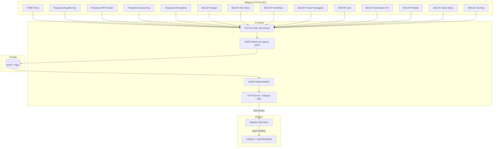

# DEMO: Live Malaysia Transit Map

> Real-time GTFS vehicle positions → IsleDB → Datastar SSE → OpenStreetMap

---

## Overview

The final demo is a live-updating transit map of Malaysia's entire public transport network. Every bus, train, and monorail reports its GPS position every 30 seconds via the Malaysian government's GTFS Realtime API. Gedung Peristiwa ingests these positions into IsleDB, persists them to Tigris/MinIO, and streams updates to a browser-based map via Datastar's SSE mechanism.

**No React. No Vue. No npm. One Go binary. One `<script>` tag.**



---

## Data Source: Malaysia GTFS Realtime

### API Endpoint

```
GET https://api.data.gov.my/gtfs-realtime/vehicle-position/<agency>
```

Returns **protobuf** binary (GTFS Realtime `FeedMessage`). Updates every **30 seconds**.

### All Vehicle Position Feeds

| Agency | Endpoint Suffix | Type | Region |
|---|---|---|---|
| KTMB | `ktmb` | Rail | National |
| Prasarana RapidKL Bus | `prasarana?category=rapid-bus-kl` | Bus | KL |
| Prasarana MRT Feeder | `prasarana?category=rapid-bus-mrtfeeder` | Bus | KL |
| Prasarana Kuantan | `prasarana?category=rapid-bus-kuantan` | Bus | Kuantan |
| Prasarana Penang | `prasarana?category=rapid-bus-penang` | Bus | Penang |
| BAS.MY Kangar | `mybas-kangar` | Bus | Perlis |
| BAS.MY Alor Setar | `mybas-alor-setar` | Bus | Kedah |
| BAS.MY Kota Bharu | `mybas-kota-bharu` | Bus | Kelantan |
| BAS.MY Kuala Terengganu | `mybas-kuala-terengganu` | Bus | Terengganu |
| BAS.MY Ipoh | `mybas-ipoh` | Bus | Perak |
| BAS.MY Seremban A | `mybas-seremban-a` | Bus | N. Sembilan |
| BAS.MY Seremban B | `mybas-seremban-b` | Bus | N. Sembilan |
| BAS.MY Melaka | `mybas-melaka` | Bus | Melaka |
| BAS.MY Johor Bahru | `mybas-johor` | Bus | Johor |
| BAS.MY Kuching | `mybas-kuching` | Bus | Sarawak |

**Total: 15 feeds across 3 agencies covering peninsula + East Malaysia.**

### Protobuf Schema (Vehicle Position)

Each `FeedEntity` contains:

```protobuf
message VehiclePosition {
  TripDescriptor trip = 1;       // trip_id, route_id, schedule_relationship
  VehicleDescriptor vehicle = 2; // id, label, license_plate
  Position position = 3;         // latitude, longitude, bearing, speed
  uint64 timestamp = 5;          // POSIX timestamp of GPS reading
}
```

### Known Data Quality Issues

| Feed | Issue | Impact |
|---|---|---|
| All buses | E028 — GPS outside service area | Occasional erroneous coordinates; filter outliers |
| `rapid-bus-kuantan`, `rapid-bus-penang` | E003/E004 — trip/route ID mismatch | Legacy systems; IDs may not match static GTFS |
| `rapid-bus-penang` | Trip ID prefix mismatch | Strip service-ID prefix to match static schedule |

**Mitigation**: Validate lat/lng bounds (Malaysia: lat 1°–7°N, lng 100°–119°E). Log and skip outliers.

---

## Frontend: Datastar + Leaflet.js

### Why Datastar

Datastar is a **hypermedia framework** (11.76 KiB) that drives the frontend from the backend via SSE. It replaces React/Vue/Svelte with declarative `data-*` HTML attributes.

- **`data-on-interval`** — Poll for map updates at a configurable interval
- **`data-signals`** — Reactive state for selected agency, vehicle count, etc.
- **`data-show`** — Toggle UI panels
- **`data-text`** — Bind stats (vehicle count, last update time)
- **`data-on:click`** — Agency filter toggles

The Go backend uses the **Datastar Go SDK** (`github.com/starfederation/datastar-go/datastar`) to stream SSE events:

```go
sse := datastar.NewSSE(w, r)

// Stream vehicle position updates as map markers
sse.PatchElements(`
    <div id="vehicle-markers">
        <!-- Leaflet markers injected here -->
    </div>
`)

// Update stats panel
sse.PatchElements(`
    <span id="vehicle-count">342</span>
`)
```

### Why Leaflet + OpenStreetMap

- **Leaflet.js** — 42 KiB, no API key required, works with any tile provider
- **OpenStreetMap tiles** — Free, open, good coverage of Malaysia
- No Google Maps API key. No Mapbox token. Just works.

### UI Layout

```
┌─────────────────────────────────────────────────────────┐
│  🚌 Gedung Peristiwa — Malaysia Transit Live            │
│  ┌─────────────┐  ┌──────────────────────────────────┐  │
│  │ Agency Panel │  │                                  │  │
│  │              │  │         OpenStreetMap             │  │
│  │ ☑ KTMB      │  │                                  │  │
│  │ ☑ RapidKL   │  │    🚂 ← train marker             │  │
│  │ ☑ MRT Feed  │  │    🚌 ← bus marker               │  │
│  │ ☑ Kuantan   │  │                                  │  │
│  │ ☑ Penang    │  │    Markers color-coded            │  │
│  │ ☐ Kangar    │  │    by agency                     │  │
│  │ ☐ Alor Star │  │                                  │  │
│  │ ...         │  │                                  │  │
│  ├─────────────┤  │                                  │  │
│  │ Stats       │  │                                  │  │
│  │ Vehicles:342│  │                                  │  │
│  │ Updated: 3s │  │                                  │  │
│  │ Events: 12k │  │                                  │  │
│  │ SSTs: 47    │  │                                  │  │
│  └─────────────┘  └──────────────────────────────────┘  │
└─────────────────────────────────────────────────────────┘
```

### Marker Strategy

- Each vehicle = one Leaflet marker with popup (vehicle ID, route, speed, bearing)
- Color-coded by agency: 🔴 KTMB, 🔵 Prasarana, 🟢 BAS.MY
- Markers update position smoothly (CSS transition on `transform`)
- Stale markers (>2 min since last update) fade to semi-transparent
- Click marker → popup with vehicle details + trail history

---

## Backend Architecture

### Component: GTFS Poller (`internal/gtfs/`)

```go
type Feed struct {
    Agency   string // e.g. "ktmb", "prasarana-rapid-bus-kl"
    URL      string // full API URL
    Category string // Prasarana category param, if any
    Type     string // "rail" or "bus"
    Region   string // display region name
}

// AllFeeds returns the complete list of 15 Malaysian GTFS-R vehicle position feeds
func AllFeeds() []Feed

// Poll fetches one feed, parses protobuf, returns []VehiclePosition
func Poll(ctx context.Context, feed Feed) ([]VehiclePosition, error)
```

- Uses `google.golang.org/protobuf` with GTFS Realtime bindings (`github.com/MobilityData/gtfs-realtime-bindings/golang/gtfs`)
- Polls all 15 feeds concurrently every 30 seconds
- Validates lat/lng within Malaysia bounds; drops GPS outliers
- Converts protobuf → Go struct → JSON for IsleDB value

### Component: IsleDB Ingestion (`internal/pipeline/`)

Each agency maps to an **IsleDB prefix** (one writer per agency):

```
Key:   {agency}:{vehicle_id}:{timestamp_ns}
Value: {"lat":3.139,"lng":101.687,"bearing":45,"speed":12.5,"route":"U32","trip":"..."}
```

The writer uses **ChangeFeed** so the tailing reader can stream new positions:

```go
opts := isledb.DefaultWriterOptions()
opts.ChangeFeed.Enabled = true
opts.Flush.Interval = 5 * time.Second  // flush every 5s for near-real-time
```

### Component: SSE Server (`internal/web/`)

```go
func (s *Server) HandleVehicleStream(w http.ResponseWriter, r *http.Request) {
    sse := datastar.NewSSE(w, r)

    // Initial load: scan all current positions
    positions := s.pipeline.ScanAllCurrentPositions(ctx)
    sse.PatchElements(renderMarkers(positions))
    sse.PatchElements(renderStats(len(positions)))

    // Tail for updates
    for update := range s.pipeline.TailUpdates(ctx) {
        sse.PatchElements(renderMarkerUpdate(update))
        sse.PatchElements(renderStats(s.pipeline.VehicleCount()))
    }
}
```

### Component: HTML Page (`internal/web/templates/`)

Single `index.html` — no build step, no bundler:

```html
<!DOCTYPE html>
<html>
<head>
    <title>Gedung Peristiwa — Malaysia Transit Live</title>
    <link rel="stylesheet" href="https://unpkg.com/leaflet/dist/leaflet.css" />
    <script src="https://unpkg.com/leaflet/dist/leaflet.js"></script>
    <script type="module" src="https://cdn.jsdelivr.net/gh/starfederation/datastar@v1/bundles/datastar.js"></script>
</head>
<body>
    <div data-signals="{selectedAgencies: [], vehicleCount: 0, lastUpdate: ''}">

        <!-- Agency filter panel -->
        <aside id="agency-panel">
            <h2>Agencies</h2>
            {{range .Agencies}}
            <label>
                <input type="checkbox" checked
                       data-on:change="@get('/api/filter')" />
                {{.Region}} — {{.Agency}}
            </label>
            {{end}}

            <div id="stats">
                <p>Vehicles: <span data-text="$vehicleCount">0</span></p>
                <p>Updated: <span id="last-update">—</span></p>
            </div>
        </aside>

        <!-- Map container -->
        <div id="map" style="height:100vh; flex:1;"></div>

        <!-- Vehicle markers managed by SSE -->
        <div id="vehicle-data"
             data-init="@get('/api/vehicles/stream')"
             style="display:none;">
        </div>
    </div>

    <script>
        // Initialize Leaflet map centered on Malaysia
        const map = L.map('map').setView([4.2, 108.0], 6);
        L.tileLayer('https://tile.openstreetmap.org/{z}/{x}/{y}.png', {
            attribution: '© OpenStreetMap'
        }).addTo(map);

        // Marker management (called by Datastar-patched elements)
        const markers = {};
        window.updateVehicle = function(id, lat, lng, agency, route, speed) {
            if (markers[id]) {
                markers[id].setLatLng([lat, lng]);
            } else {
                markers[id] = L.circleMarker([lat, lng], {
                    radius: 5,
                    color: agencyColor(agency),
                    fillOpacity: 0.8
                }).addTo(map).bindPopup(`${agency} — ${route}<br>Speed: ${speed} km/h`);
            }
        };
    </script>
</body>
</html>
```

---

## IsleDB ↔ GTFS Mapping: Why This Works

### The FinTech Parallel

The GTFS demo is structurally identical to a FinTech event pipeline:

| GTFS Realtime | FinTech Equivalent |
|---|---|
| Vehicle position event | Transaction event |
| Agency (KTMB, Prasarana) | Tenant (Bank A, Bank B) |
| Vehicle ID | Account/customer ID |
| GPS coordinate | Transaction amount/metadata |
| 30s polling interval | Real-time transaction feed |
| Route/trip | Business process/workflow |

### How IsleDB Solves the Same Problems

| Problem | GTFS Context | IsleDB Solution |
|---|---|---|
| **Data silos** | 15 separate API feeds, different formats | One writer per agency prefix, single object store |
| **Data drift** | Feeds update at different rates, some lag | Manifest log provides ordered replay; `Refresh()` catches up |
| **Data duplication** | Same vehicle appears in overlapping feeds | Same vehicle_id key → LSM compaction keeps latest |
| **Ordering** | Need chronological vehicle trail | Key format `{agency}:{vehicle}:{timestamp}` = sorted by time |
| **Fan-out** | Map view + analytics + alerting | Multiple tailing readers on same prefix |

### What the Demo Proves

1. **Multi-tenant ingestion at scale** — 15 concurrent feeds, hundreds of vehicles
2. **Real-time tailing** — IsleDB ChangeFeed → SSE → browser in <5s
3. **Object storage durability** — All positions persisted to MinIO/Tigris as SSTs
4. **Horizontal read scaling** — Map viewer is just a reader; add more readers freely
5. **Compaction** — Old positions compacted away; storage stays bounded
6. **No Kafka** — The entire pipeline is one Go binary + object storage

---

## Key Dependencies

| Dependency | Purpose |
|---|---|
| `github.com/ankur-anand/isledb` | Embedded KV on object storage |
| `github.com/starfederation/datastar-go/datastar` | SSE event streaming to browser |
| `github.com/MobilityData/gtfs-realtime-bindings/golang/gtfs` | GTFS-R protobuf parsing |
| `google.golang.org/protobuf` | Protobuf runtime |
| Leaflet.js (CDN) | Map rendering |
| OpenStreetMap tiles | Map tiles (no API key) |

**No npm. No webpack. No node_modules.**

---

## Project Structure

```
cmd/
  demo/
    main.go                  # HTTP server + GTFS poller + IsleDB pipeline
internal/
  gtfs/
    feeds.go                 # Feed definitions (all 15 endpoints)
    poller.go                # Concurrent protobuf fetcher + validator
    types.go                 # VehiclePosition, FeedMessage Go types
  pipeline/
    writer.go                # IsleDB writer (one per agency prefix)
    reader.go                # IsleDB reader + tailing reader
    pipeline.go              # Orchestrator: poll → write → tail
  web/
    server.go                # HTTP routes + Datastar SSE handlers
    render.go                # HTML fragment rendering for SSE patches
    templates/
      index.html             # Single-page app (Leaflet + Datastar)
      components/
        marker.html          # Vehicle marker fragment
        stats.html           # Stats panel fragment
        agency-panel.html    # Agency filter fragment
  model/
    event.go                 # Shared event types
```

---

## Implementation Phases

### Phase 1: GTFS Poller (standalone)
- [ ] Define all 15 feed URLs
- [ ] Fetch + parse protobuf for each feed
- [ ] Validate GPS bounds (Malaysia: 1°–7°N, 100°–119°E)
- [ ] Log vehicle counts per agency
- [ ] Unit test with saved protobuf fixtures

### Phase 2: IsleDB Integration
- [ ] One IsleDB prefix per agency
- [ ] Write vehicle positions with ChangeFeed enabled
- [ ] Reader scans current positions per agency
- [ ] Tailing reader streams new positions
- [ ] Integration test with `blobstore.NewMemory()`

### Phase 3: Datastar Web UI
- [ ] Serve `index.html` with embedded Leaflet + Datastar
- [ ] SSE endpoint streams initial positions + tailed updates
- [ ] `PatchElements` updates marker positions on map
- [ ] Agency filter checkboxes toggle feed visibility
- [ ] Stats panel shows vehicle count, last update, event count

### Phase 4: Polish
- [ ] Color-code markers by agency type (rail vs bus)
- [ ] Stale marker detection (fade after 2 min)
- [ ] Vehicle popup with details (route, speed, bearing)
- [ ] Responsive layout for mobile
- [ ] IsleDB retention policy (keep last 24h of positions)

---

## Running the Demo

```bash
# Prerequisites
mise run doctor

# Start MinIO + demo server
overmind start

# Or run directly
minio server ./data/minio --address :9000 &
go run ./cmd/demo/

# Open browser
open http://localhost:8080
```

The map should show live vehicle markers updating every ~30 seconds, with the stats panel reflecting real-time counts from the GTFS Realtime API.

---

## Rate Limits & Fair Use

The Malaysia Open API has rate limits (see [developer.data.gov.my](https://developer.data.gov.my)). The demo:
- Polls each feed at most once per 30 seconds (matching their update frequency)
- Uses a single HTTP client with reasonable timeouts
- Does not cache-bust or bypass any rate limiting
- Respects `429` responses with exponential backoff