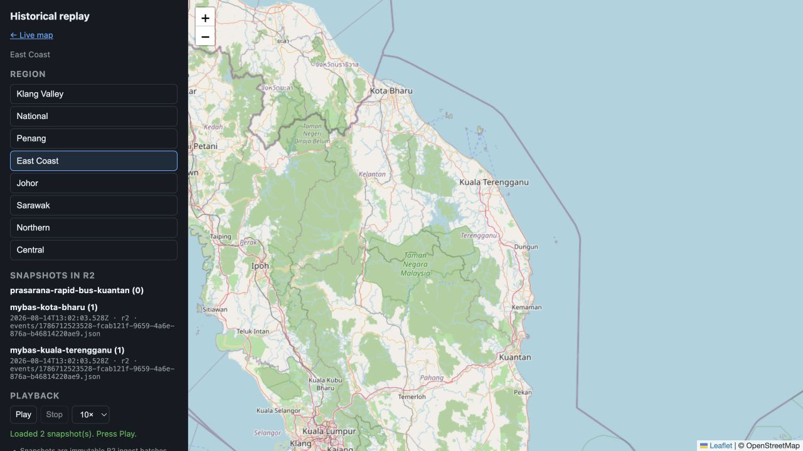
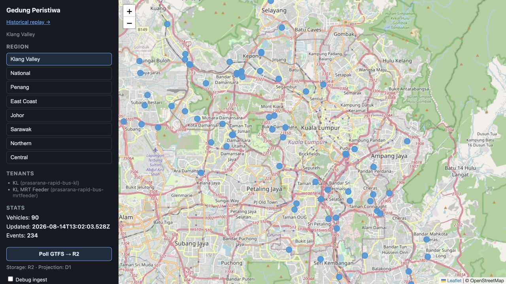

# Gedung Peristiwa

**Gedung Peristiwa** (Indonesian: "Event House") — a local MVP that simulates multi-tenant FinTech events through IsleDB into S3-compatible object storage (MinIO locally, Tigris in the cloud).

The demo proves write → flush → read → tail → compact with ordering and deduplication via UUID v7 idempotency keys.

## Prerequisites

Install [mise](https://mise.jdx.dev/), then from this repo:

```bash
mise trust          # allow project mise.toml
mise install        # Go 1.26 (from mise.toml [tools])
```

Optional system tools checked by doctor:

- **Required:** `go`, `mise`, `overmind`, `minio`
- **Optional:** `mc` or `aws` CLI (bucket setup), `tigris`, `air`, `rg`, `fzf`

```bash
brew install minio/stable/minio overmind
```

## Environment

All runtime config loads from `.env` via mise (`[env] _.file = ".env"` in `mise.toml`).

```bash
cp .env.example .env
```

Edit `.env` for Tigris credentials when running the cloud validation step.

## Quick start (MVP demo)

### 1. Doctor — check tools and env

```bash
mise run doctor
```

Verifies Go 1.26.x, mise, overmind, minio, and that `MINIO_*` vars are set from `.env`.

### 2. Tests — unit + integration (no MinIO)

```bash
mise run test
```

Uses in-memory IsleDB (`blobstore.NewMemory`); no external services.

### 3. MVP demo — dev UI + MinIO

Starts MinIO, creates the bucket, and runs the **dev HTTP control plane** (with [air](https://github.com/air-verse/air) live reload):

```bash
mise run dev
```

Open **http://localhost:8080** — dashboard shows MinIO + Tigris connectivity, key counts per tenant, and errors in red. Click **Run simulation** to trigger the MVP pipeline (fast mode, 100 events).

| Process | What it does |
|---------|----------------|
| `minio` | Local S3 at `localhost:9000` (console `:9001`) |
| `dev` | Waits for MinIO, runs `minio-setup`, then **air** HTTP UI on `:8080` |

CLI simulation (no UI):

```bash
mise run simulate          # MinIO, 60s / 1000 events
go run ./cmd/simulate/ --backend memory --fast --events 100
```

### 4. Tigris validation (optional)

After MinIO passes, run the same pipeline against a Tigris bucket:

```bash
# Set real credentials in .env:
# AWS_ACCESS_KEY_ID, AWS_SECRET_ACCESS_KEY, AWS_REGION=auto, TIGRIS_BUCKET

mise run simulate-tigris
```

Uses the same verification as MinIO (read-back, key order, compaction dedup).

### 5. Codex Sites — Wrangler + D1 + R2

The generated Codex Sites version replaces MinIO with Cloudflare R2 and uses D1 for the live projection and replay catalog. It fetches the current region's GTFS-Realtime feeds directly, writes each raw poll batch to R2, and renders the resulting vehicle positions in the browser. The live page polls automatically every 30 seconds; the button triggers an immediate refresh.

```bash
mise run sites:test       # compile, initialize local D1, and serve with Wrangler
mise run sites:compile    # regenerate codex-sites/ only
```

The generated bundle is disposable and ignored by git. The rendered East Coast replay catalog below shows R2-backed snapshots after a live GTFS poll:



The live Klang Valley view after GTFS ingestion:



## All mise tasks

| Task | Command | Description |
|------|---------|-------------|
| Doctor | `mise run doctor` | Check prerequisites and env |
| Test | `mise run test` | Unit + integration tests (`-race -cover`) |
| E2E | `mise run test-e2e` | MinIO E2E tests (`//go:build e2e`) |
| Dev | `mise run dev` | overmind: MinIO + setup + air HTTP UI (`:8080`) |
| Simulate | `mise run simulate` | Simulation against MinIO only |
| Tigris | `mise run simulate-tigris` | Simulation against Tigris |
| MinIO setup | `mise run minio-setup` | Create bucket (MinIO must be running) |
| Sites compile | `mise run sites:compile` | Generate the Codex Sites D1 + R2 bundle |
| Sites test | `mise run sites:test` | Run the generated bundle locally with Wrangler |
| Lint | `mise run lint` | `go vet ./...` |

Makefile shortcuts: `make doctor`, `make test`, `make dev`, `make simulate`, `make simulate-tigris`.

## Simulation flags

```bash
go run ./cmd/simulate/ --backend minio|tigris|memory \
  --duration 60s \
  --events 1000 \
  --fast \                    # skip wall-clock pacing (tests/smoke)
  --prefix-suffix my-run-id   # isolate IsleDB prefixes per run
```

## Docs

- [PRD.md](PRD.md) — MVP scope and success criteria
- [TECHSPEC.md](TECHSPEC.md) — architecture and component design
- [DEMO.md](DEMO.md) — post-MVP Malaysia transit map demo
- [AGENTS.md](AGENTS.md) — agent / implementation notes
