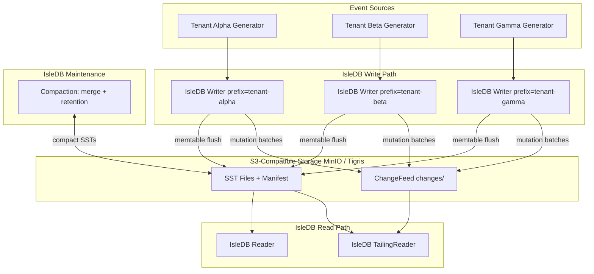
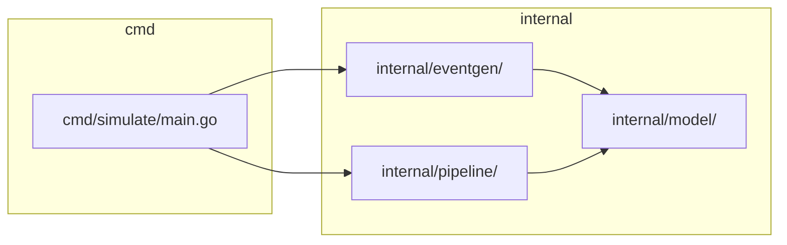
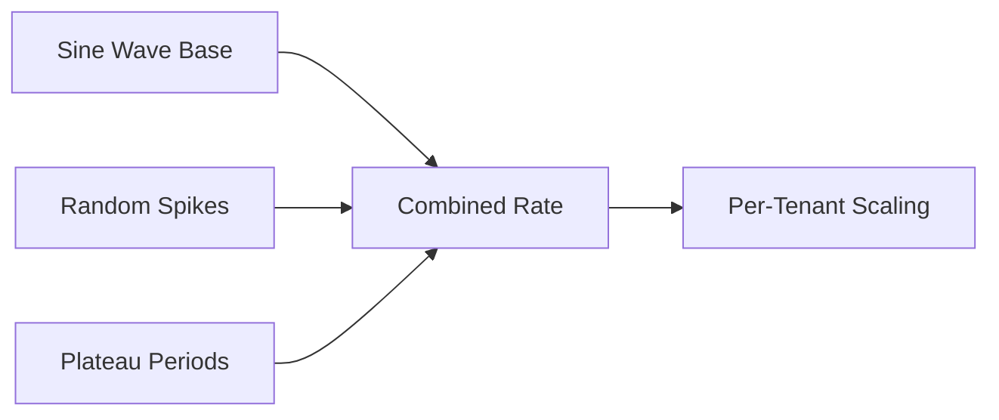
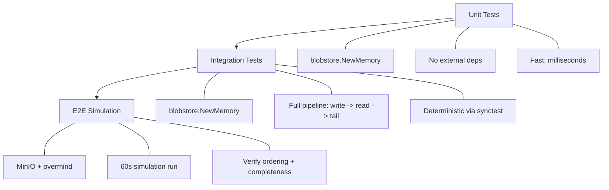

# Technical Specification: Gedung Peristiwa

> **"Event Building"** — A multi-tenant FinTech event simulation platform demonstrating how IsleDB + S3-compatible object storage solves common data infrastructure problems.

---

## 1. Architecture Overview

The system models a simplified FinTech event pipeline where multiple tenants generate financial events. Events flow through IsleDB's LSM-tree engine, are persisted as SST files in S3-compatible storage (MinIO locally, Tigris in production), and can be replayed or tailed by downstream consumers.



### Data Flow

1. **Write path**: Event generators produce events → IsleDB Writer buffers in memtable → flushes SST files to object storage bucket under a tenant-specific prefix.
2. **Read path**: IsleDB Reader opens a snapshot of the manifest and reads SSTs from object storage. `Refresh()` picks up new SSTs.
3. **Tailing path**: IsleDB TailingReader polls for new ChangeFeed entries under `changes/`, providing ordered replay of mutations.
4. **Maintenance**: Compaction merges small SSTs, applies age-based or time-window retention, and rewrites the manifest — all via CAS operations on the object store.

---

## 2. Key Design Decisions

### IsleDB as the Write-Ahead + Compaction Layer

IsleDB is **not** a message broker. It is an embedded LSM-tree database that writes its storage files (SSTs, manifest, bloom filters) to an S3-compatible object store. This gives us:

- Durable, ordered writes without running a separate database server
- Built-in compaction and retention without custom garbage collection
- ChangeFeed for ordered replay without a separate WAL service

### Tigris/MinIO as Durable Storage

The object store is **not** a database. It is a durable, scalable blob store. IsleDB owns the data format and access patterns; the object store provides persistence and availability.

### Single Writer per Tenant Prefix

IsleDB enforces a single writer per prefix via epoch fencing. This is a feature, not a limitation — it prevents split-brain writes and ensures manifest consistency. We achieve multi-tenancy by assigning one prefix per tenant.

### Key Format

```
{tenant_id}:{event_type}:{timestamp_ns}:{uuid}
```

- **Natural ordering**: Keys sort by tenant → event type → time → unique ID
- **Range scans**: `Scan("tenant-alpha:transaction:", "tenant-alpha:transaction:\xff")` returns all transactions for a tenant in time order
- **Deduplication**: Same idempotency key maps to the same KV key; LSM compaction collapses duplicates

### Value Format

JSON-encoded event payload. Chosen for readability, debuggability, and stdlib support (`encoding/json`). Binary formats (protobuf, msgpack) are a future optimization if payload size becomes a concern.

### ChangeFeed

Enabled on all writers. ChangeFeed writes seq-ordered mutation batches under `changes/`, providing a durable, ordered log of all writes — essential for audit trails in FinTech.

---

## 3. Component Design



### `cmd/simulate/`

Main simulation binary. Wires together event generators, IsleDB pipelines, and the run loop. Reads configuration from environment variables and flags.

### `internal/model/`

Event data models shared across packages.

```go
type Event struct {
    TenantID       string    `json:"tenant_id"`
    EventType      EventType `json:"event_type"`
    Timestamp      time.Time `json:"timestamp"`
    Payload        Payload   `json:"payload"`
    IdempotencyKey string    `json:"idempotency_key"`
}

type EventType string

const (
    EventTransaction  EventType = "transaction"
    EventBalanceCheck EventType = "balance_check"
    EventKYCUpdate    EventType = "kyc_update"
    EventFraudAlert   EventType = "fraud_alert"
    EventSettlement   EventType = "settlement"
)

type Payload struct {
    Amount      float64           `json:"amount,omitempty"`
    Currency    string            `json:"currency,omitempty"`
    AccountID   string            `json:"account_id,omitempty"`
    Description string            `json:"description,omitempty"`
    Metadata    map[string]string `json:"metadata,omitempty"`
}
```

### `internal/eventgen/`

Multi-tenant event generator with realistic traffic patterns. Produces events on a channel, simulating bursty FinTech workloads.

Responsibilities:
- Generate events for N tenants concurrently
- Apply traffic shaping (sine wave, spikes, plateaus)
- Assign idempotency keys (UUID v7 for time-ordering)
- Respect cancellation via `context.Context`

### `internal/pipeline/`

IsleDB writer/reader/tailer wrapper. Abstracts blobstore setup, writer options, and provides clean interfaces for the simulation.

Responsibilities:
- Open blobstore (memory for tests, S3 for simulation)
- Create per-tenant IsleDB writers with appropriate options
- Provide reader/tailer access for verification
- Handle graceful shutdown (flush + close)

---

## 4. Event Generation Strategy

### Volume

- **Target**: 1000 events over 60 seconds (~16.7 events/sec average)
- **Distribution**: Uneven across tenants and time to simulate real-world patterns

### Tenants

| Tenant ID       | Profile          | Approx. Share |
|-----------------|------------------|---------------|
| `tenant-alpha`  | High-volume bank | 40%           |
| `tenant-beta`   | Mid-tier fintech | 25%           |
| `tenant-gamma`  | Small processor  | 15%           |
| `tenant-delta`  | Startup          | 12%           |
| `tenant-epsilon`| Micro service    | 8%            |

### Event Types

| Event Type      | Relative Frequency | Typical Payload Size |
|-----------------|-------------------|---------------------|
| `transaction`   | 50%               | ~200 bytes          |
| `balance_check` | 25%               | ~100 bytes          |
| `kyc_update`    | 5%                | ~300 bytes          |
| `fraud_alert`   | 5%                | ~250 bytes          |
| `settlement`    | 15%               | ~180 bytes          |

### Traffic Patterns



- **Sine wave base**: `rate = base_rate * (1 + 0.5 * sin(2π * t / period))` with period ~15s
- **Random spikes**: Poisson-distributed bursts (2-5x normal rate) lasting 1-3 seconds
- **Plateau periods**: Sustained elevated rate (1.5x) for 5-10 seconds, simulating batch processing windows
- **Per-tenant scaling**: Each tenant's base rate is scaled by their share percentage

---

## 5. How IsleDB Solves FinTech Data Problems

### Data Silos

**Problem**: Different systems maintain separate copies of event data, leading to inconsistency.

**Solution**: All events for a tenant land in a single object storage prefix. Any number of horizontal readers can open the same prefix and read the same data. IsleDB's manifest provides a consistent view — readers see a snapshot, call `Refresh()` to pick up new SSTs.

### Data Drift

**Problem**: Multiple writers updating the same data can cause divergent views.

**Solution**: 
- IsleDB's **manifest log** provides an ordered history of all SST changes
- **Epoch fencing** prevents stale writers from corrupting the manifest — if a writer loses its epoch, writes are rejected
- ChangeFeed provides an ordered replay log independent of SST compaction

### Data Duplication

**Problem**: Retries and at-least-once delivery cause duplicate events.

**Solution**:
- Events with the same idempotency key produce the same KV key
- LSM compaction naturally deduplicates: when merging SSTs, only the latest value for a key survives
- Result: eventual deduplication without explicit dedup logic

### Ordering Guarantees

**Problem**: Distributed systems make global ordering expensive.

**Solution**:
- Within a prefix (tenant), SST sequence numbers provide total ordering of flushes
- Within an SST, keys are sorted (LSM property)
- The manifest log records SST additions in order
- ChangeFeed entries are seq-ordered
- **Net effect**: global ordering within a tenant prefix, without coordination

---

## 6. Tigris-Specific Capabilities Leveraged

While MinIO provides S3 compatibility for local development, Tigris offers additional capabilities that align with IsleDB's architecture:

| Capability | How It's Used |
|---|---|
| **FoundationDB consistency** | Manifest CAS operations (conditional writes via `If-Match`) get strong consistency guarantees, critical for epoch fencing |
| **Bucket snapshots** | Point-in-time recovery of an entire tenant's event store — useful for audit, compliance, and disaster recovery |
| **Conditional operations** | `If-Match` headers align with IsleDB's CAS-based manifest writes, preventing lost updates during compaction |
| **Metadata querying** | Query SST metadata (size, age, key range) for operational dashboards without reading file contents |
| **Object rename** | Atomic rename for compaction output files — avoids partial-write visibility |
| **Global distribution** | Future: multi-region event stores with Tigris replication, no application-level changes needed |

> **Note**: MinIO for local dev does not support Tigris-specific features (snapshots, metadata query, rename). Tests using `blobstore.NewMemory()` bypass the object store entirely.

---

## 7. Testing Strategy



### Unit Tests

- **Storage**: `blobstore.NewMemory("test-prefix")` — no MinIO, no network
- **Scope**: Individual functions: key formatting, event generation rates, traffic shaping math, model serialization
- **Determinism**: Use `testing/synctest` for time-dependent logic; first-class functions for injectable dependencies
- **Coverage target**: 80%+

### Integration Tests

- **Storage**: `blobstore.NewMemory("test-prefix")` — still no external deps
- **Scope**: Full pipeline exercised in-process:
  1. Generate N events for M tenants
  2. Write through IsleDB writers
  3. Flush and close writers
  4. Open readers, verify all events present
  5. Open tailers, verify ordered replay via ChangeFeed
- **Determinism**: `RegisterDelayedCallback` in Temporal test suite for workflow timing; `synctest` for pipeline timing
- **Assertions**: Event count, ordering (timestamp monotonicity within tenant+type), deduplication after compaction

### E2E Simulation

- **Storage**: MinIO (local S3)
- **Scope**: Full 60-second simulation with real object storage
- **Setup**: `overmind start` (MinIO + simulation binary)
- **Verification**:
  - Total events written = total events read
  - Keys within each tenant prefix are lexicographically ordered
  - ChangeFeed entries are seq-ordered
  - No data loss after compaction
- **CI/CD**: This level runs in CI after unit/integration tests pass

### Coverage

```
Target: 80%+ overall
  internal/model/     → 90%+  (pure data, easy to test)
  internal/eventgen/  → 85%+  (deterministic with synctest)
  internal/pipeline/  → 75%+  (integration-heavy, memory blobstore)
  cmd/simulate/       → 60%+  (wiring, covered by E2E)
```

---

## 8. Local Development Setup

### Prerequisites

| Tool | Purpose | Install |
|---|---|---|
| Go 1.26.x | Runtime | `mise use go@1.26` |
| MinIO | Local S3 | `brew install minio/stable/minio` or Docker |
| overmind | Process manager | `brew install overmind` |
| mise | Task runner | `brew install mise` |

### Environment Variables

```bash
# .mise.toml or .env
MINIO_ENDPOINT=localhost:9000
MINIO_ACCESS_KEY=minioadmin
MINIO_SECRET_KEY=minioadmin
MINIO_BUCKET=gedung-peristiwa
MINIO_USE_SSL=false
```

### IsleDB Connection String

```go
// Local development (MinIO)
store, err := blobstore.Open(ctx,
    "s3://gedung-peristiwa?endpoint=localhost:9000&disableSSL=true&s3ForcePathStyle=true",
    tenantPrefix,
)

// Production (Tigris)
store, err := blobstore.Open(ctx,
    "s3://gedung-peristiwa?region=auto",
    tenantPrefix,
)

// Tests (in-memory)
store := blobstore.NewMemory(tenantPrefix)
```

### Procfile (overmind)

```procfile
minio: minio server ./data --console-address :9001
simulate: go run ./cmd/simulate/
```

### mise Tasks

```toml
# mise.toml
[tasks.doctor]
description = "Check prerequisites"
run = """
go version
minio --version
overmind version
"""

[tasks.test]
description = "Run unit + integration tests"
run = "go test -race -cover ./..."

[tasks.simulate]
description = "Run full E2E simulation"
run = "overmind start"

[tasks.lint]
description = "Run linter"
run = "go vet ./..."
```

---

## 9. Tradeoffs & Limitations

| Aspect | Decision | Tradeoff |
|---|---|---|
| **Single writer** | One IsleDB writer per tenant prefix | No concurrent writes to same tenant; fine for MVP with prefix-per-tenant isolation |
| **Read latency** | 1-10s acceptable (reader must `Refresh()` to see new SSTs) | Suitable for analytics, audit, compliance — not for real-time trading or sub-10ms reads |
| **No transactions/joins** | IsleDB is a KV store, not an OLTP database | Not replacing PostgreSQL; complementing it for event storage and replay |
| **Eventual dedup** | Duplicates exist between compaction runs | Consumers must tolerate brief duplicates or use idempotency keys for at-most-once processing |
| **Tailing is polling** | `TailingReader.Tail()` polls for new ChangeFeed entries | Not true push/streaming like Kafka consumer groups; adequate for audit/replay workloads |
| **Local vs. prod parity** | MinIO lacks Tigris features (snapshots, metadata query) | Tests use `blobstore.NewMemory()`; Tigris-specific features tested only in staging/prod |
| **JSON payloads** | Human-readable but larger than binary formats | Acceptable for MVP; switch to protobuf if payload size becomes a bottleneck |
| **No schema evolution** | JSON fields can be added but not removed safely | Use optional fields with `omitempty`; formal schema registry is out of scope |

---

## 10. Dependencies

### Go Modules

```
go 1.26.5

require (
    github.com/ankur-anand/isledb        latest   // Embedded LSM-tree on object storage
    github.com/tigrisdata/storage-go      latest   // Tigris SDK (future Tigris-specific features)
    github.com/google/uuid                latest   // UUID v7 for idempotency keys
)
```

### Infrastructure

| Component | Local Dev | Production |
|---|---|---|
| Object Storage | MinIO (`minio server ./data`) | Tigris (`t3.storage.dev`) |
| Process Manager | overmind | systemd / container orchestrator |
| Task Runner | mise | mise (CI) |
| Workflow Engine | Temporal CLI (`temporal server start-dev`) | Temporal Cloud |

### Dev Tools

| Tool | Purpose |
|---|---|
| `air` | Live reload during development |
| `ripgrep` | Fast code search |
| `fzf` | Fuzzy file finder |
| `goreleaser` | Release builds |
| `watchexec` | File watcher for custom tasks |

---

## Appendix: Key Format Examples

```
tenant-alpha:transaction:1737849600000000000:0192b3a4-5c6d-7e8f-9a0b-1c2d3e4f5a6b
tenant-alpha:transaction:1737849601000000000:0192b3a4-6d7e-8f9a-0b1c-2d3e4f5a6b7c
tenant-alpha:balance_check:1737849600500000000:0192b3a4-7e8f-9a0b-1c2d-3e4f5a6b7c8d
tenant-beta:fraud_alert:1737849602000000000:0192b3a4-8f9a-0b1c-2d3e-4f5a6b7c8d9e
```

Scanning all transactions for tenant-alpha:
```go
iter := reader.Scan(
    []byte("tenant-alpha:transaction:"),
    []byte("tenant-alpha:transaction:\xff"),
)
for iter.Next() {
    key, value := iter.Key(), iter.Value()
    // process event...
}
```

Scanning all events for tenant-beta (any type):
```go
iter := reader.Scan(
    []byte("tenant-beta:"),
    []byte("tenant-beta:\xff"),
)
```
